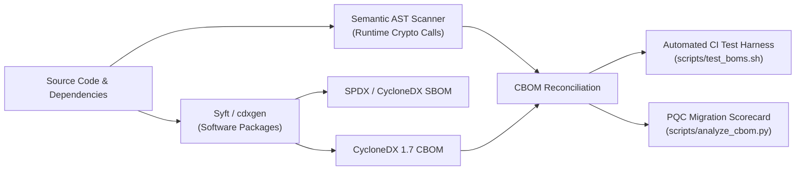

# Conjur Certificate Lifecycle Demo

## Overview

This repository contains a **working demonstration** of using **CyberArk Conjur** as a **policy‑controlled certificate issuance and renewal component** for internal workloads.

The demo shows how short‑lived X.509 certificates can be:
- Issued from CSRs
- Strongly bound to workload identity
- Automatically renewed
- Used for mutual TLS (mTLS)
- Governed through policy‑as‑code and audit logs

> ⚠️ **Important:**  
> This repository does **not** represent a full Certificate Lifecycle Management (CLM) platform.  
> It intentionally focuses on **issuance + renewal** for workloads, aligned to modern Zero Trust patterns.

---

## What This Demo Is (and Is Not)

### ✅ This demo **IS**
- A demonstration of **policy‑driven certificate issuance**
- A model for **short‑lived workload certificates**
- An example of **renewal‑based lifecycle control**
- Aligned to cloud‑native and service‑to‑service (mTLS) use cases
- Designed to be auditable and automation‑first

### ❌ This demo **IS NOT**
- A replacement for enterprise PKI
- A user or device certificate management solution
- A certificate discovery or inventory system
- A CRL or OCSP implementation
- A compliance or regulatory reporting platform

---

## Architectural Intent

The demo positions Conjur as:

> **An online, policy‑controlled intermediate CA for internal workload identity**

Key architectural principles demonstrated:

| Principle | Demo Behaviour |
|---------|---------------|
| Least privilege | Certificates issued only to authorised identities |
| Private key isolation | Keys generated and stored only by workloads |
| Short lifetimes | Certificates measured in hours, not months |
| Automation | Renewal replaces manual rotation |
| Governance | Control via identity, policy, and logs |

---

## High‑Level Architecture

```text
Workload A ──(CSR)──▶ CA Signer ──(Cert)──▶ Workload A
     │                                   │
     └───────────── mTLS ────────────────┘
                     ▼
                Workload B
```

## How the Demo Works

1. **Initialization (`init.sh`)**: The environment starts by cleanly generating a new local Demo Root CA and bringing up Conjur and a PostgreSQL database.
2. **Policy Loading**: A Conjur policy is automatically loaded, which defines namespaces, creates identities for `workload-a` and `workload-b`, and sets the permissions that authorize them to request certificates from the CA.
3. **Sidecar Execution**: The workloads (`workload-a` and `workload-b`) launch with a sidecar. Each sidecar:
   - Locally generates an RSA private key.
   - Generates a Certificate Signing Request (CSR) with the appropriate SPIFFE identity.
   - Authenticates directly with Conjur using its securely provided API Key.
   - Requests a signed certificate from the dedicated CA signer service.
   - Saves the signed certificate alongside the private key and then sleeps.
   - Wakes up to automatically renew the certificate before it expires.
4. **Mutual TLS**: 
   - `workload-b` (Server) runs a Flask API over HTTPS, configured to require client certificates. It verifies the client certificate against the Root CA.
   - `workload-a` (Client) continually makes HTTPS GET requests to `workload-b`. It uses its own generated client certificate to authenticate and verifies the server's identity against the Root CA.

## Running the Demo

1. Simply execute the initialization script:
   ```bash
   bash init.sh
   ```
2. The script will output verbose statuses of each step as it automatically builds and launches the environment.
3. Once initialization is complete, observe the active mTLS traffic between the applications:
   ```bash
   docker compose logs -f workload-a workload-b
   ```
4. Look for messages from the sidecars indicating that they are securely managing their own identities, and requests being successfully served by the server over an authenticated mTLS session.

### Expected Output

You should see output similar to the following, demonstrating the successful extraction of identity attributes from the newly minted certificates and the subsequent successful mTLS verification:

```text
workload-b-1  | [Sidecar] Certificate received and saved to /certs/tls.crt
workload-b-1  | [Sidecar] --- Certificate Attributes ---
workload-b-1  | [Server] Waiting for sidecar to provision certificates...
workload-b-1  | [Server] Certificates found. Starting mTLS server.
workload-b-1  | [Server] Listening on https://0.0.0.0:8443
workload-b-1  | [Sidecar] Subject : CN=workload-b
workload-b-1  | [Sidecar] Issuer  : CN=Demo-Root-CA
workload-b-1  | [Sidecar] Valid   : May 20 12:20:38 2026 GMT to May 21 12:20:38 2026 GMT
workload-b-1  | [Sidecar] SANs    : URI:spiffe://demo/workload-b,DNS:workload-b
workload-b-1  | [Sidecar] ------------------------------
workload-b-1  | [Sidecar] Sleeping before renewal check...
workload-a-1  | [Sidecar] Certificate received and saved to /certs/tls.crt
workload-a-1  | [Sidecar] --- Certificate Attributes ---
workload-a-1  | [Sidecar] Subject : CN=workload-a
workload-a-1  | [Sidecar] Issuer  : CN=Demo-Root-CA
workload-a-1  | [Sidecar] Valid   : May 20 12:20:39 2026 GMT to May 21 12:20:39 2026 GMT
workload-a-1  | [Sidecar] SANs    : URI:spiffe://demo/workload-a,DNS:workload-a
workload-a-1  | [Sidecar] ------------------------------
workload-a-1  | [Sidecar] Sleeping before renewal check...
workload-a-1  | [Client] Waiting for sidecar to provision certificates...
workload-a-1  | [Client] Certificates found. Starting mTLS client.
workload-a-1  | [Client] Attempting mTLS connection to Workload B...
workload-b-1  | 172.18.0.5 - - [20/May/2026 12:20:39] "GET / HTTP/1.1" 200 -
workload-a-1  | [Client] Response: 200 - Hello from Workload B! mTLS connection successful.
```

---

## Repository Governance & Supply Chain Security

This repository enforces the **Repository Governance Orchestrator** baseline to guarantee developer experience, commit hygiene, multi-layer security scanning, and dual-engine cryptographic supply chain visibility.

### 🛡️ Dual-Engine SBOM & CBOM Architecture

Manifest scanners alone cannot identify instantiated cryptographic algorithms in source code. This project implements a **dual-engine scanning architecture**:
1. **Manifest Engine (Syft / cdxgen)**: Inventories software packages and dependencies into SPDX (`oss/sbom.spdx.json`) and CycloneDX (`oss/cbom.json`).
2. **Semantic AST Engine (`scripts/scan_crypto_ast.py`)**: Traverses source code abstract syntax trees across Python, JS/TS, Go, Java, C/C++, Rust, and C# to identify runtime crypto call sites and automatically reconcile them into the CBOM.
3. **Automated CI Test Harness (`scripts/test_boms.sh`)**: Enforces 4 strict gates in CI and locally, failing builds if BOMs are missing, invalid, or contain zero cryptographic assets.



### 📊 Local BOM Generation & Verification

Generate and verify bill of materials locally:

```bash
# 1. Generate SBOM and CBOM with semantic AST reconciliation
bash scripts/generate_boms.sh .

# 2. Run automated validation test harness (4/4 gates)
bash scripts/test_boms.sh oss

# 3. Generate Post-Quantum Cryptography (PQC) markdown & JSON scorecards
python3 scripts/analyze_cbom.py oss/cbom.json \
  --markdown oss/crypto-summary.md \
  --json oss/crypto-analysis.json
```

### 🔒 Continuous Security & Governance Workflows

| Workflow | Purpose | Standards & Controls |
| :--- | :--- | :--- |
| [**`sbom.yml`**](.github/workflows/sbom.yml) | Dual-Engine SBOM & CBOM | Syft, cdxgen (`--include-crypto`), AST reconciliation, release asset attachment |
| [**`security-testing.yml`**](.github/workflows/security-testing.yml) | Multi-Layer Security | Gitleaks (secrets), Semgrep (SAST OWASP Top 10), Trivy (filesystem & dependency CVEs) |
| [**`commit-lint.yml`**](.github/workflows/commit-lint.yml) | Commit Hygiene | Enforces [Conventional Commits](CONTRIBUTING.md#commit-message-guidelines) on all PRs and pushes |
| [**`changelog.yml`**](.github/workflows/changelog.yml) | Automated Releases | `git-cliff` automated `CHANGELOG.md` generation from commit messages |
| [**`docker-publish.yml`**](.github/workflows/docker-publish.yml) | Container Publishing | Multi-image container builds with Node 24 and immutable SHA-pinned actions |
| [**`nightly-updates.yml`**](.github/workflows/nightly-updates.yml) | Automated Maintenance | Nightly dependency upgrades verified by live mTLS container spin-up |

---

## Gotchas

* **Node 24 Modernization & Immutable SHA Pinning:** When GitHub Actions runners complain about Node 20 deprecation, simply bumping `@v4` or `@v7` is insufficient and exposes workflows to supply chain tampering. All GitHub Actions in this repository must use Node 24-compatible releases and be pinned to explicit 40-character commit SHAs (e.g., `actions/checkout@3d3c42e5aac5ba805825da76410c181273ba90b1 # v7.0.1`).
* **JSON Arguments for ENTRYPOINT/CMD in Dockerfiles:** Always use the JSON array format (e.g., `CMD ["sh", "-c", "script.sh & python app.py"]`) rather than the shell form in Dockerfiles. The shell form can cause unintended behavior related to OS signals, as it may prevent signals like `SIGTERM` from correctly propagating to the underlying processes when stopping the container.
* **Cryptographic Material File Permissions:** All private keys (`ca.key`, workload `tls.key`) must strictly use `600` permissions (`chmod 600`), and containers must execute as non-root users (`USER appuser`).